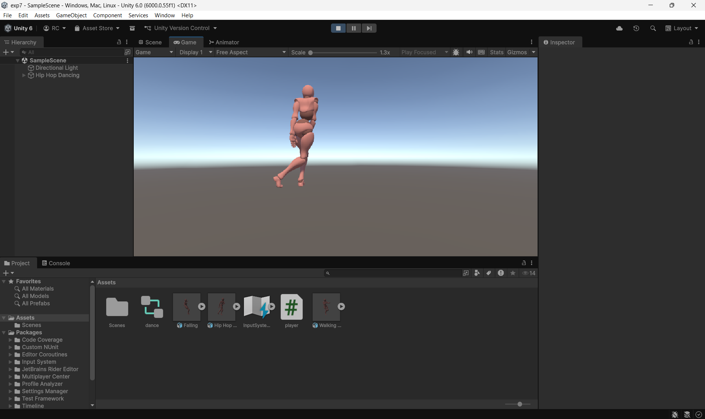

# Ex5-Animator-Movement
## Aim:
To develop a animator movement for a player using unity.

## Algorithm:
## Step 1: 

Import necessary models.

## Step 2: 

 Right-click -> Create -> Animator Controller.

## Step 3: 

Open Animator window, define states (Idle, Run, Jump, etc.).

## Step 4: 

Use keyframes or Unity's Animation tools to animate transitions between states.

## Step 5: 

Drag Animator Controller to the GameObject in the Inspector.

## Program:

#### Developed by: VARUN JC
#### Reg no: 212224240179

## PlayerController:
```c#
using UnityEngine;

public class player : MonoBehaviour
{
    public Animator animator;
    public float intputX;
    public float intputY;
    // Start is called once before the first execution of Update after the MonoBehaviour is created
    void Start()
    {
        animator = this.gameObject.GetComponent<Animator>();
        
    }

    // Update is called once per frame
    void Update()
    {
        intputX = Input.GetAxis("Horizontal");
        intputY = Input.GetAxis("Vertical");

        animator.SetFloat("inputX", intputX);
        animator.SetFloat("inputY", intputY);
        
    }
}


```
## Output:



## Result:

An animator movement for a player using unity is developed successfully.


